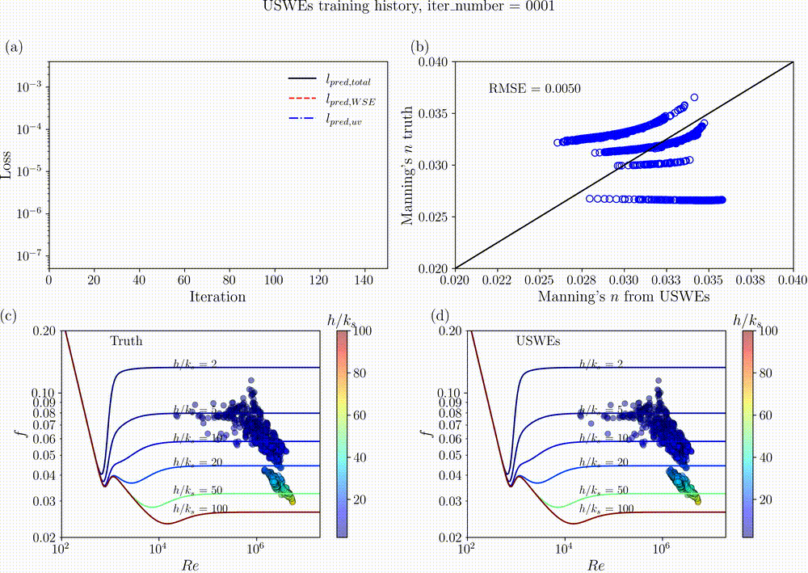
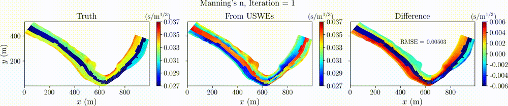

# Hydrograd
### ***Computational Hydrodynamics with Automatic Differentiation for Scientific Machine Learning***

How to cite: Liu and Song (2025), Universal Shallow Water Equations with Differentiable 
Programming for Scientific Machine Learning, [https://arxiv.org/abs/2502.12396](https://arxiv.org/abs/2502.12396)

<p align="center">
  
</p>

<p align="center">
  <em>Training history visualization of the Universal Shallow Water Equations (USWEs) for Manning's n parameter estimation in the Savannah River case. The animation shows the evolution of the training loss history and the predicted Manning's n field during the training process.</em>
</p>

<p align="center">
  
</p>

<p align="center">
  <em>Animation of the Manning's n iterations for the Savannah River case. The animation shows the evolution of the Manning's n field during the training process using the Universal Shallow Water Equations (USWEs).</em>
</p>


Hydrograd is a Julia-based computational hydrodynamics package with automatic differentiation (AD) capabilities. The package is designed to solve the partial differential equations (PDEs) of hydrodynamics, including the shallow water equations (SWEs) and the Navier-Stokes equations (NS). Currently, the package is under development and only supports the SWEs.

Hydrograd heavily relies on [SciML.jl](https://github.com/SciML/SciML.jl), which is a collection of tools for scientific machine learning and differential equation solving. 

## Overview
Hydrograd provides ***differentiable models*** for solving the hydrodynamics governing equations with finite volume methods. It supports:
- Forward simulation of flow dynamics
- Parameter inversion 
- Sensitivity analysis through automatic differentiation
- Physics discovery through universal differential equations (UDEs): For the case of the shallow water equations, it is called the universal shallow water equations (USWEs).

For parameter inversion and sensitivity analysis, the package uses the automatic differentiation capabilities of [ForwardDiff](https://github.com/JuliaDiff/ForwardDiff.jl) and [Zygote](https://github.com/FluxML/Zygote.jl). The parameters currently supported are Manning's coefficient, bed elevation, and inlet discharge, which cover many common cases in the field of hydrodynamics, such as river flow, flood wave, and dam break. More parameters will be supported in the future. Users can also define their own parameters and use them in the parameter inversion and sensitivity analysis.

## Features
- The models are differentiable with respect to the parameters and the initial conditions. 
- Differentiable models can bridge physics-based and data-driven models, for example, the use of [universal differential equations (UDEs)](https://arxiv.org/abs/2001.04385) to bridge the gap between the shallow water equations and the neural networks.
- The models are designed to be compatible with the [SciML.jl](https://github.com/SciML/SciML.jl) ecosystem, which includes a wide range of tools for scientific machine learning and differential equation solving.
- Automatic differentiation using [ForwardDiff](https://github.com/JuliaDiff/ForwardDiff.jl) and [Zygote](https://github.com/FluxML/Zygote.jl)

## Other notable features
- Finite volume discretization on unstructured meshes
- Gudonov-type Riemann solver for the inviscid part of the fluxes
- Support for various boundary conditions
- For 2D cases, the package directly supports the file format of the [SRH-2D](https://www.usbr.gov/tsc/techreferences/computer%20software/models/srh2d/index.html) solver (USBR's Sedimentation and River Hydraulics - Two-Dimensional model; GUI with [SMS](https://aquaveo.com/software/sms/introduction)).

## Why Julia?
- Julia is a high-performance programming language for technical computing. 
- Julia is compatible with the [SciML.jl](https://github.com/SciML) ecosystem.
- Currently, the computing speed of other languages such as Python is not fast enough for computing-intensive tasks such as computational hydrodynamics and CFD, especially for large-scale real-world problems. PyTorch, TensorFlow, and other deep learning frameworks are designed for machine learning and neural networks where the majority of computing is fast linear algebra. Although improvements have been made, they are not designed for scientific computing where the computing has many conditional branches and floating-point operations.

## Prerequisites
- Julia 1.11 or later
- Python 3.10 or later (optional, for post-processing)
- Git

## Installation

### Installation Steps

1. Clone the repository:
```bash
git clone https://github.com/psu-efd/Hydrograd.jl.git
cd Hydrograd.jl
```

2. Start Julia with the project environment:
```bash
julia --project=.
```

3. Enter the package mode by pressing `]`, then instantiate the environment:
```julia
pkg> instantiate
```

Or alternatively, you can run this as a single command:
```bash
julia --project=. -e 'using Pkg; Pkg.instantiate()'
```

### Verification
To verify your installation, run the test suite:
```julia
pkg> test
```

### Troubleshooting
If you encounter any issues during installation:
1. Make sure you have the correct versions of Julia and Python installed
2. Check that all prerequisites are properly installed
3. For further assistance, please open an issue on our GitHub repository

## License
MIT License

## Contact
Xiaofeng Liu, Ph.D., P.E.

Department of Civil and Environmental Engineering

Institute of Computational and Data Sciences

Penn State University

Web: [https://water.engr.psu.edu/liu/](https://water.engr.psu.edu/liu/)

Email: [xiaofengliu19@gmail.com](mailto:xiaofengliu19@gmail.com)

For questions and support, please open an issue in the repository.
